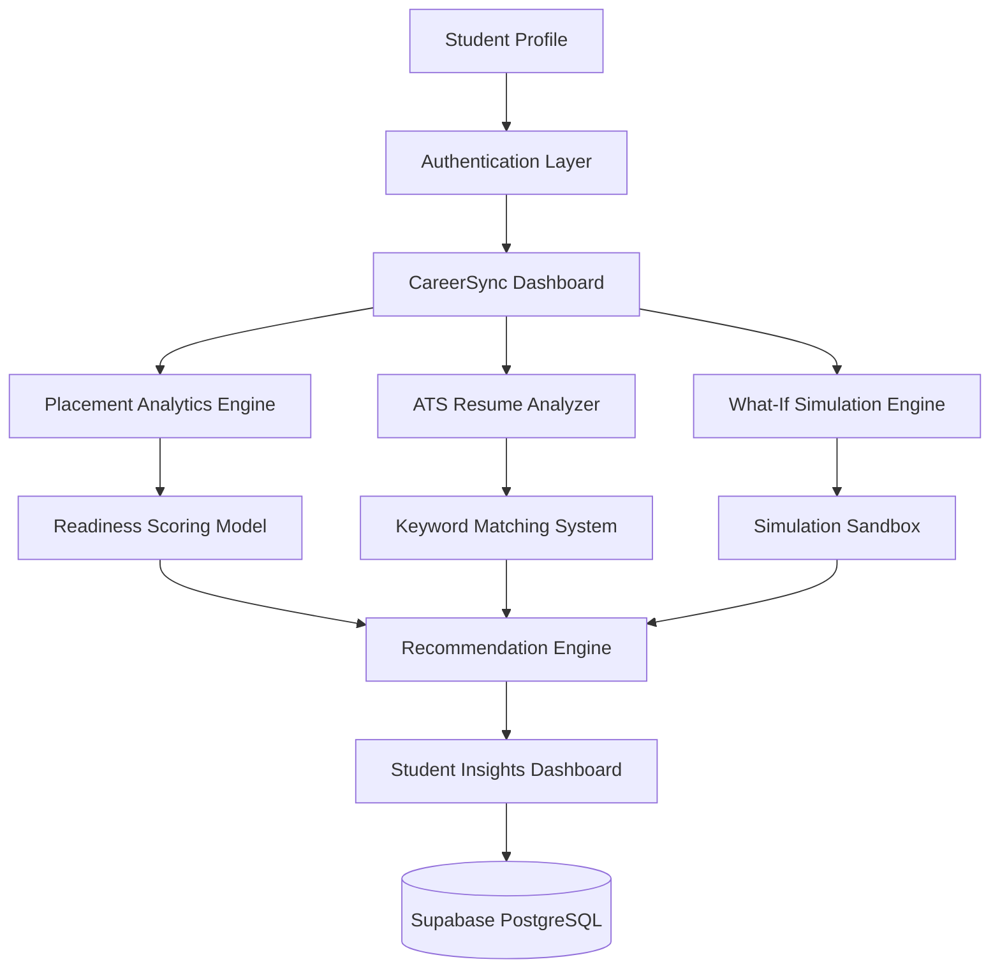

# 📊 CareerSync | Student Placement Analytics Portal

[](https://python.org)
[](https://supabase.com)
[](https://postgresql.org)

A full-stack student placement analytics platform that helps students evaluate their career readiness through profile analysis, ATS resume evaluation, skill-gap detection, and interactive career simulations.

CareerSync consolidates academic performance, technical skills, certifications, projects, and resume strength into a unified dashboard, providing data-driven insights and personalized recommendations to support placement preparation.

🌐 **Live Demo:** https://careersyncsite.streamlit.app/

---

## 📸 Application Preview


---

## ✨ Key Features

### 🔐 Secure Authentication & Cloud Profiles

* User registration and login system
* Session-based authentication
* Secure cloud-synced user profiles
* Individual dashboard access for every user

### 📊 Placement Readiness Analytics

* Multi-factor readiness score generation
* Academic performance assessment
* Technical skill evaluation
* Certification and project analysis
* Interactive performance dashboards

### 📝 ATS Resume Analysis

* Resume keyword matching
* Missing skill identification
* ATS compatibility evaluation
* Resume optimization recommendations
* Role-specific keyword suggestions

### 🎯 Skill Gap Assessment

* Compare profiles against target career paths
* Identify missing competencies
* Generate personalized recommendations
* Highlight priority learning areas

### 🧪 What-If Simulation Engine

Students can simulate profile improvements by adding:

* Technical Skills
* Certifications
* Projects
* Competitive Programming Achievements

and instantly visualize how those changes affect readiness metrics.

### 📈 Interactive Analytics Dashboard

* Readiness Score Tracking
* Skill Distribution Analysis
* Certification Impact Monitoring
* ATS Match Insights
* Dynamic Plotly Visualizations

---

## 🏗️ System Architecture



---

## 🧠 Analytics Workflow

### Profile Evaluation

The platform evaluates:

* Academic Performance
* Technical Skills
* Certifications
* Projects
* Resume Quality

to generate an overall career readiness score.

### ATS Processing

Resume content is analyzed against predefined skill datasets to identify:

* Missing Keywords
* Skill Deficiencies
* ATS Optimization Opportunities

### Simulation Module

Students can experiment with hypothetical profile improvements and immediately visualize projected changes without affecting their original data.

---

## 🛠️ Technology Stack

### Frontend

* Streamlit

### Backend

* Python 3.11

### Database

* Supabase
* PostgreSQL

### Authentication

* Supabase Authentication

### Data Processing

* Pandas
* NumPy

### Data Visualization

* Plotly Graph Objects

### Version Control

* Git
* GitHub

---

## 📂 Project Structure

```text
CareerSync/
│
├── app.py
├── pages/
├── data/
├── assets/
├── utils/
├── requirements.txt
└── README.md
```

---

## ⚙️ Installation

### Clone Repository

```bash
git clone https://github.com/shravani492006/CareerSync.git

cd CareerSync
```

### Install Dependencies

```bash
pip install -r requirements.txt
```

### Configure Environment Variables

Create:

```text
.streamlit/secrets.toml
```

Add:

```toml
[supabase]
url = "your_supabase_project_url"
key = "your_supabase_anon_key"
```

### Run Application

```bash
streamlit run app.py
```

---

## 🧩 Engineering Challenges

### Readiness Scoring Model

Designed a weighted scoring framework capable of evaluating multiple profile dimensions while maintaining meaningful and interpretable results.

### Cloud Database Design

Structured relational PostgreSQL schemas to securely associate authenticated users with profile data and analytics records.

### ATS Evaluation Logic

Implemented keyword analysis workflows capable of identifying missing technical competencies and generating targeted recommendations.

### Simulation Architecture

Built isolated simulation workflows that perform hypothetical calculations without modifying live user profiles.

---

## 🚀 Future Enhancements

* AI Resume Builder
* Mock Interview Generator
* Learning Roadmap Generator
* Resume PDF Export
* Company-Specific Readiness Analysis
* Placement Prediction Models

---

## 👩‍💻 Author

**Shravani Kadam**

B.Tech Information Technology Student

Built to explore full-stack development, cloud database integration, data analytics, ATS evaluation systems, and student placement intelligence using Python and Streamlit.

GitHub: https://github.com/shravani492006

---

⭐ If you found this project useful, consider giving the repository a star.
